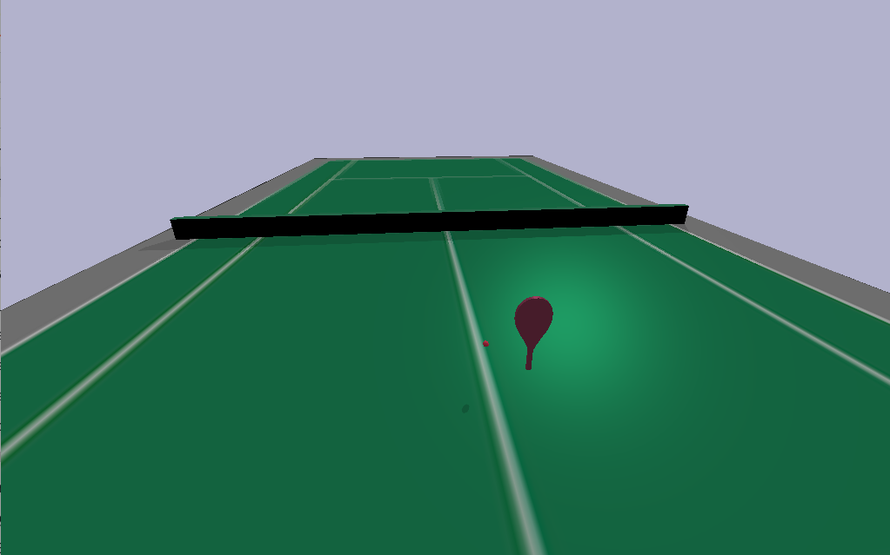

# tennisbot-rl

The original tennisbot model is obtained from https://github.com/CORE-Robotics-Lab/Wheelchair-Tennis-Robot



## Installation

install dependencies
 - pybullet
 - gym
 - stable-baselines3
 - simple_pid

Install the py pkg
```bash
cd tennisbot
pip install -e . 
```

## Run Demo

```bash
cd ..
```

Run pybullet playground
```bash
python3 playground.py
```

Run gym training
```bash
# run default trpo agent with 100 iteratios
python3 main.py -i 100
```

## Notes
 - Revert back to `gym` instead of `gymnasium` since `stable-baselines` does not support `gymnasium` yet: https://github.com/DLR-RM/stable-baselines3/pull/780
