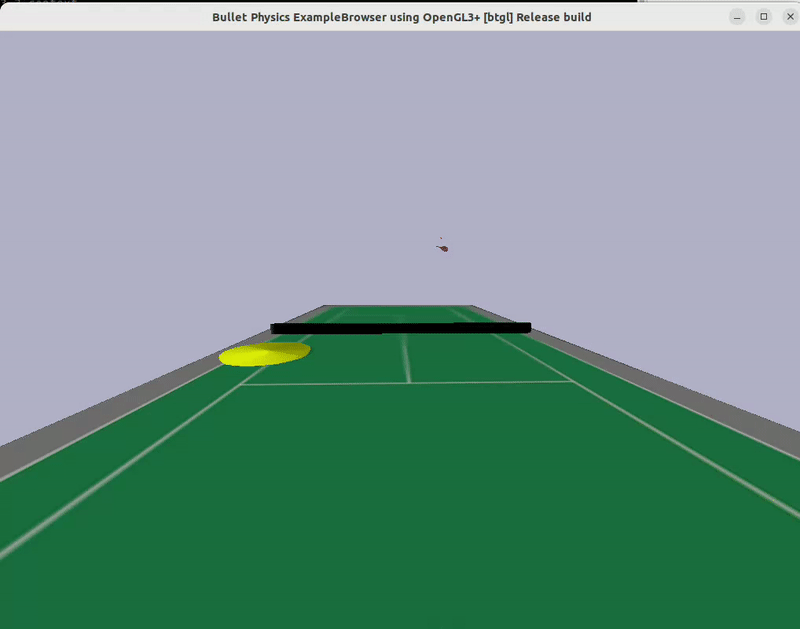

# tennisbot-rl

This is a simple floating racket environment to try use RL to hit incoming ball and learn to swing the racket.



## Installation

install dependencies
 - pybullet
 - gym
 - stable-baselines3
 - simple_pid
 - sb3_contrib

Install the py pkg
```bash
cd tennisbot
pip install -e . 
```

## Run Demo

```bash
cd ..
```

Run pybullet playground
```bash
python3 playground.py --swing
```

## Train swing racket task environment

Run gym training
```bash
## Add --gui to show visualization
python3 train_swing.py

# to check tensorboard
tensorboard --logdir=/tmp/ppo_swing/
```

** Is better to train the model locally from scarth, since it was noticed that the policy works slightly different on computer's pybullet env.

Validate Model with pretrained model
```bash
python3 validate_swing.py  -m backup_models/ppo_swing.zip
```

## train hit incoming tennis ball task environment

** Still in progress not make it learnable.

Run gym training
```bash
python3 train.py
# or 
python3 train.py -s tuned_ppo
```

Validate Model
```bash
python3 validate.py
```

## Try out evolutionary algorithm

**This is still in testing mode, there is memory leak problem when running it on linux environment, will need further scrutiny**

Example:
```bash
python3 train_static.py --generations 10 --popsize 10 --environment SwingRacket-v0
```

Validate Model
```bash
python3 evaluate_static.py --environment SwingRacket-v0 --path_weights backup_models/es_swing.dat
```

## Notes
 - Revert back to `gym` instead of `gymnasium` since `stable-baselines` does not support `gymnasium` yet: https://github.com/DLR-RM/stable-baselines3/pull/780
 - This work is inspired by the by the tennisbot project, from https://github.com/CORE-Robotics-Lab/Wheelchair-Tennis-Robot
